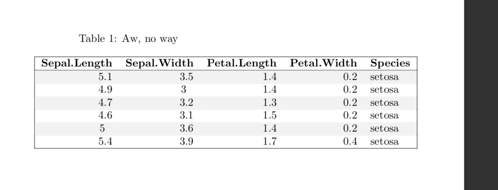
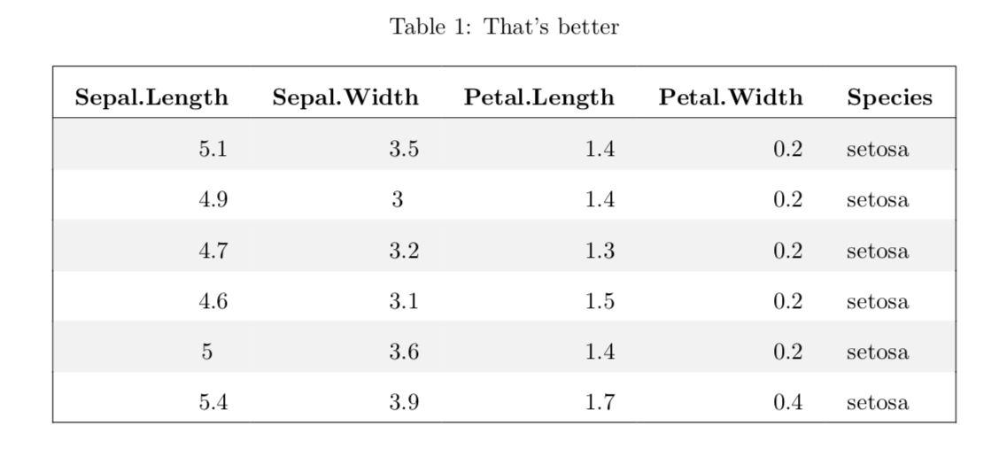

```{r setup, echo = FALSE, cache = FALSE}

## Global options
options(max.print = "75")
knitr::opts_chunk$set(
         prompt = FALSE,
         message = FALSE,
         warning = FALSE
      )
knitr::opts_knit$set(width = 75)
```


# Good times for table makers

The [gt package](https://gt.rstudio.com) is out on [CRAN](https://cran.r-project.org/package=gt). If you want to produce
presentation tables in R, you should definitely check it out -- it's written
by the guys at RStudio and has the high quality you would expect.

Meanwhile, the [huxtable](https://hughjonesd.github.io/huxtable) package still 
might be useful. In particular, if you want to output to PDF 
(or HTML, Word, Powerpoint, Excel, RTF or Markdown), huxtable can do that.

Version 5.0.0 of huxtable is coming out shortly. This article describes
some of its new features. Click the links on the left to learn more.


```{r, echo = FALSE}
huxtable::hux_logo(html = TRUE)
```


# Markdown in cells

You can now use markdown to format text in cell contents.


```{r}

library(huxtable)
library(dplyr)

jams %>% 
      set_markdown_contents(1, 1:2, 
        c("*Type* of jam", "*Price* of jam")
      ) %>% 
      set_markdown_contents(3, 2, "~2.10~ **Sale!** 1.50")

```


The `set_markdown_contents()` is a shortcut function that sets the `markdown`
property to `TRUE`. 

For now, markdown is supported in HTML and LaTeX, with basic support for on-screen
output.

# Improved LaTeX output

Many tweaks have been made to how huxtables are displayed in LaTeX. In
particular, the "adjustbox" TeX package is now used to centre tables, meaning
that -- at last -- **tables now stay robustly in the middle of the page**.


```{r, eval = FALSE}

iris_hux <- as_hux(head(iris), add_colnames = TRUE) %>% 
              theme_plain() %>% 
              set_position("center")

install.packages("huxtable")
 
iris_hux %>% 
      set_caption("Aw, no way") %>% 
      quick_pdf(file = "old-version.pdf")

remotes::install_github("hughjonesd/huxtable")

iris_hux %>% 
      set_caption("That's better") %>% 
      quick_pdf(file = "new-version.pdf")

```






This change needs a recent version of the "adjustbox" package from 
[CTAN](https://ctan.org).
`huxtable::check_latex_dependencies()` will check this for you, and
`install_latex_dependencies()` will try to update you automatically.

There are other improvements too. Padding now works better, and cell wrapping
is more sensible by default.

# Better borders

To make a coloured or styled border in huxtable, you used to have to write:


```{r}
jams %>% 
      set_bottom_border(1, everywhere, 2) %>% 
      set_bottom_border_style(1, everywhere, "dashed") %>% 
      set_bottom_border_color(1, everywhere, "#078bcc")
```


This could get laborious. Huxtable 5.0.0 has a new `brdr()` class to set all
these features at once.


```{r}
jams %>% 
      set_bottom_border(1, everywhere, brdr(2, "dashed", "#078bcc"))
```


Border internals have also been reworked, fixing some long-standing bugs.
The following code used to give a nasty surprise:


```{r, eval = FALSE}

install.packages("huxtable")
as_hux(matrix(c("Multirow cell", rep("Cell", 8)), 3, 3)) %>% 
      set_bottom_border(1, everywhere, 0.4) %>% 
      set_rowspan(1, 1, 2) %>% 
      set_caption("Wait, why has my border moved?")

```


```
 Wait, why has my border moved?  
  Multirow cell   Cell    Cell   
                ─────────────────
                  Cell    Cell   
─────────────────                
  Cell            Cell    Cell   

Column names: V1, V2, V3
```

It now does what you would expect:


```{r, eval = FALSE}

remotes::install_github("hughjonesd/huxtable")
as_hux(matrix(c("Multirow cell", rep("Cell", 8)), 3, 3)) %>% 
      set_bottom_border(1, everywhere, 0.4) %>% 
      set_rowspan(1, 1, 2) %>% 
      set_caption("That's better")

```


```
                                    That's better                                    
                            Multirow cell   Cell    Cell   
                                          ─────────────────
                                            Cell    Cell   
                            Cell            Cell    Cell   

Column names: V1, V2, V3
```

Terminal printing now also respects the huxtable `position`, incidentally.

Lastly, there are new functions to quickly set vertical and horizontal borders:


```{r}
jams %>% set_tb_borders(0.4) 
```


# Splitting tables

Here's a common problem: your table is too wide or long for the page.


```{r}

library(dplyr)
car_hux <- mtcars %>% 
      head() %>% 
      select(
        "Miles per gallon"           = mpg, 
        "Cylinders"                  = cyl, 
        "Displacement"               = disp,
        "Horsepower"                 = hp, 
        "Drat, my table is too wide" = drat
      ) %>% 
      as_hux(add_rownames = "Model") %>% 
      set_header_cols(1, TRUE)

car_hux
```

Huxtable now has some nice ways to deal with this. First, you can split your
table in two:

```{r}
car_list <- split_down(car_hux, after = "Cylinders")
car_list[[1]]
car_list[[2]]
```

Notice that both of the split tables still have the model names on the left. 
That's because we set them as a **header column**, using some more new 
functionality. Header columns don't change style by themselves, but you can
apply your own styles easily.

# Restacking tables

Another way to change the table size is to **restack** it. Here, we restack
our table of cars to go down the page. 


```{r}
car_hux %>% 
      restack_down(cols = 4) %>% 
      style_header_rows(bold = TRUE, bottom_border = 0.4)
```

`style_header_rows()` can be used to give header rows their own look.
Notice that header rows don't have to be on top of the table.

As well as `split_down()` and `restack_down()`, there's `split_across()` and
`restack_across()`, for when your tables are too long. To explain how restacking
works, a picture will help.


```{r}
lego_hux <- as_hux(matrix(1:16, 4, 4, byrow = TRUE)) %>% 
      set_all_borders(brdr(2, color = "white")) %>% 
      set_text_color("white") %>% 
      set_background_color(1:2, 1:2, "#00695b") %>% 
      set_background_color(1:2, 3:4, "#32b8f0") %>% 
      set_background_color(3:4, 1:2, "#067ab8") %>% 
      set_background_color(3:4, 3:4, "#d14141") 

lego_hux %>% set_caption("Original table")

lego_hux %>% 
      restack_across(rows = 2) %>% 
      set_caption("Restacked across")

lego_hux %>% 
      restack_down(cols = 2) %>% 
      set_caption("Restacked down")
```

By default, huxtable will warn you if your restacked table doesn't fit evenly.


# Automatic labels

Huxtable now sets labels from the knitr chunk header by default.

This makes referencing from [bookdown](https://bookdown.org) easy: 

````
Some iris species are shown in \@ref(tab:mytable):

```{r mytable}`r ''`
hux(head(iris))
```
````


# Intuitive defaults

Huxtable 5.0.0 sets sensible defaults for some arguments. So, instead of writing


```{r, eval = FALSE}
jams <- jams %>% 
      set_bold(1, everywhere, TRUE) %>% 
      set_italic(everywhere, 1, TRUE) %>% 
      set_bottom_border(1, everywhere, 0.4)
```


you can just write


```{r, results ='hide'}
jams <- jams %>% 
      set_bold(1, everywhere) %>% 
      set_italic(everywhere, 1) %>% 
      set_bottom_border(1, everywhere)
```


(Why else would you use `set_bold()` in the first place?)


```{r}
jams
```


# Easy number formatting

Huxtable's number formatting is powerful, but hasn't been easy to use. 
`fmt_pretty()` and `fmt_percent()` help you print nice looking numbers.


```{r}
jams$Sugar <- c("Sugar content", 0.4, 0.35, 0.45)
jams$Sales <- c("Monthly sales", 35000, 55500, 2000)
jams %>% 
      set_number_format(everywhere, "Sugar", fmt_percent(1)) %>% 
      set_number_format(everywhere, "Sales", fmt_pretty())
```


# Try it out

To try out the new features in 5.0.0, run:


```{r, eval = FALSE}

remotes::install_github("hughjonesd/huxtable")

```

If you find a bug, report it on [github](https://github.com/hughjonesd/huxtable/issues).

You can go back to the CRAN version with:


```{r, eval = FALSE}

install.packages("huxtable")

```


Happy table making!
